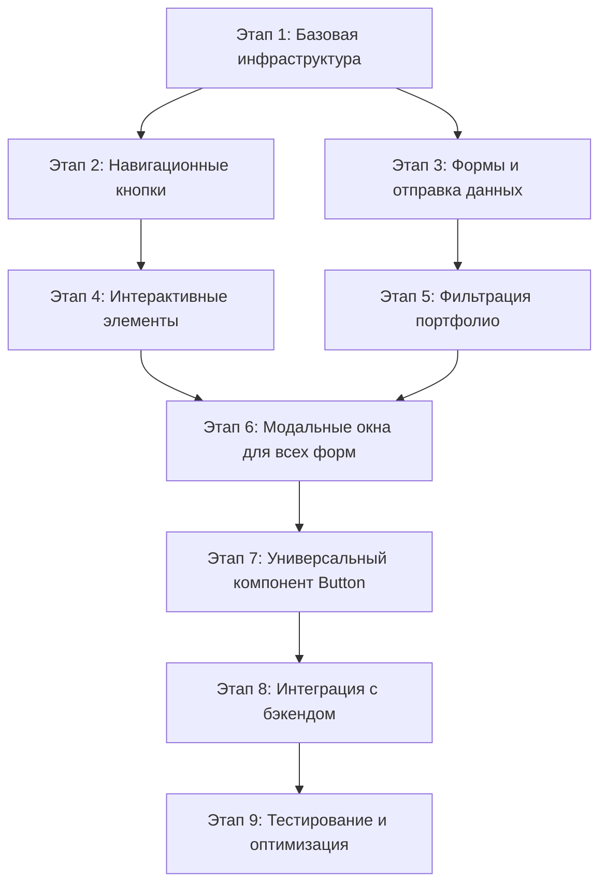

# План реализации функционала кнопок для проекта "МеталлПро"

## Обзор проекта
- **Фреймворк**: Next.js 14 с TypeScript
- **Стилизация**: Tailwind CSS
- **Текущее состояние**: 16 уникальных кнопок в 7 компонентах без обработчиков событий
- **Цель**: Реализовать полный функционал согласно технической спецификации

## Архитектурные решения

### 1. Структура новых файлов и папок
```
metalpro-next/
├── app/
│   ├── context/                    # Контексты приложения
│   │   ├── AppContext.tsx          # Глобальное состояние (модалки, формы)
│   │   └── ModalContext.tsx        # Контекст модальных окон
│   │
│   ├── hooks/                      # Кастомные хуки
│   │   ├── useScrollTo.ts          # Плавный скролл к секциям
│   │   ├── useModal.ts             # Управление модальными окнами
│   │   ├── useForm.ts              # Управление формами (валидация, отправка)
│   │   ├── useCarousel.ts          # Управление каруселью отзывов
│   │   ├── useAccordion.ts         # Управление аккордеоном FAQ
│   │   └── usePortfolioFilter.ts   # Фильтрация портфолио
│   │
│   ├── components/ui/              # UI компоненты
│   │   ├── Button/                 # Универсальный компонент кнопки
│   │   │   ├── Button.tsx
│   │   │   ├── Button.types.ts
│   │   │   └── Button.styles.ts
│   │   │
│   │   ├── Modal/                  # Компонент модального окна
│   │   │   ├── Modal.tsx
│   │   │   ├── Modal.types.ts
│   │   │   └── Modal.styles.ts
│   │   │
│   │   ├── FormModal/              # Специализированная модалка для форм
│   │   │   ├── FormModal.tsx
│   │   │   └── index.ts
│   │   │
│   │   ├── Carousel/               # Карусель отзывов
│   │   │   ├── Carousel.tsx
│   │   │   ├── Carousel.types.ts
│   │   │   └── Carousel.styles.ts
│   │   │
│   │   └── Accordion/              # Аккордеон FAQ
│   │       ├── Accordion.tsx
│   │       ├── Accordion.types.ts
│   │       └── Accordion.styles.ts
│   │
│   ├── components/forms/           # Формы
│   │   ├── ContactForm.tsx         # Контактная форма
│   │   ├── CallbackForm.tsx        # Форма обратного звонка
│   │   ├── CalculationForm.tsx     # Форма расчета стоимости
│   │   ├── ConsultationForm.tsx    # Форма консультации
│   │   ├── OrderForm.tsx           # Форма заказа услуги
│   │   ├── MeasurementForm.tsx     # Форма вызова замерщика
│   │   └── ProjectDetails.tsx      # Детали проекта
│   │
│   └── services/                   # Сервисы API
│       ├── api.ts                  # Основной API клиент
│       ├── forms.ts                # Функции отправки форм
│       └── types.ts                # Типы данных
│
└── components/                     # Существующие компоненты (будут модифицированы)
    ├── Header.tsx                  # + обработчики навигации, модалки
    ├── Hero.tsx                    # + обработчики скролла и модалки
    ├── Services.tsx                # + обработчик модалки
    ├── Portfolio.tsx               # + фильтрация, модалка деталей
    ├── Pricing.tsx                 # + обработчики модалок заказа
    ├── Contact.tsx                 # + отправка формы, аккордеон
    └── Testimonials.tsx            # + карусель
```

### 2. Приоритеты реализации (согласно спецификации)

#### Приоритет 1 (Критический)
1. **Навигационные кнопки** (скролл к секциям)
   - Хук `useScrollTo`
   - Модификация Header и Hero компонентов
   - Время: 2-3 часа

2. **Форма обратной связи** в разделе Contact
   - Валидация полей
   - Отправка на бэкенд
   - Состояния кнопки (loading, success, error)
   - Время: 4-5 часов

3. **Кнопка "Заказать звонок"** в Header
   - Модальное окно с формой
   - Интеграция с API
   - Время: 3-4 часа

#### Приоритет 2 (Высокий)
1. **Кнопки фильтров портфолио**
   - Логика фильтрации
   - Состояние активного фильтра
   - Время: 3-4 часа

2. **Кнопки карусели отзывов**
   - Реализация карусели
   - Обработчики навигации
   - Время: 3-4 часа

3. **Аккордеон FAQ**
   - Логика раскрытия/скрытия
   - Анимация
   - Время: 2-3 часа

#### Приоритет 3 (Средний)
1. **Модальные окна для всех форм**
   - Компонент `Modal`
   - Управление состоянием через Context
   - Время: 4-5 часов

2. **Состояния кнопок** (loading, disabled, success)
   - Универсальный компонент `Button` с состояниями
   - Интеграция во все кнопки
   - Время: 3-4 часа

3. **Интеграция с бэкендом для всех форм**
   - Создание API сервисов
   - Обработка ответов
   - Время: 3-4 часа

#### Приоритет 4 (Низкий)
1. **Оптимизация и рефакторинг**
   - Вынесение общих хуков
   - Создание компонента `Button`
   - Время: 2-3 часа

2. **Расширенные состояния**
   - Анимации hover/active
   - Валидация в реальном времени
   - Время: 2-3 часа

## Пошаговый план реализации

### Этап 1: Базовая инфраструктура (День 1)
1. **Создать контекст приложения** (`app/context/AppContext.tsx`)
   - Состояние модальных окон
   - Состояние форм
   - Портфолио фильтры

2. **Реализовать хук useScrollTo** (`app/hooks/useScrollTo.ts`)
   ```typescript
   const useScrollTo = () => {
     const scrollToSection = (sectionId: string) => {
       const element = document.getElementById(sectionId);
       if (element) element.scrollIntoView({ behavior: 'smooth' });
     };
     return { scrollToSection };
   };
   ```

3. **Создать базовый компонент Modal** (`app/components/ui/Modal/Modal.tsx`)
   - Props: `isOpen`, `onClose`, `title`, `children`
   - Анимация появления/исчезновения
   - Оверлей, закрытие по клику вне или ESC

### Этап 2: Навигационные кнопки (День 1-2)
1. **Модифицировать Header.tsx**
   - Заменить `<a href="#services">` на `<button onClick={() => scrollToSection('services')}>`
   - Добавить обработчик для "Заказать звонок" → `openModal('callback')`
   - Реализовать toggle для бургер-меню

2. **Модифицировать Hero.tsx**
   - "Смотреть портфолио" → `scrollToSection('portfolio')`
   - "Рассчитать стоимость" → `openModal('calculation')`

3. **Протестировать плавный скролл** по всем секциям

### Этап 3: Формы и отправка данных (День 2-3)
1. **Реализовать хук useForm** (`app/hooks/useForm.ts`)
   - Валидация полей
   - Состояния: `isSubmitting`, `errors`, `isSuccess`
   - Метод `handleSubmit`

2. **Создать FormModal компонент** (`app/components/ui/FormModal/FormModal.tsx`)
   - Наследует от Modal
   - Добавляет форму, кнопки отправки, состояния загрузки

3. **Реализовать Contact форму** (`app/components/forms/ContactForm.tsx`)
   - Интеграция с useForm
   - Валидация: имя, телефон, сообщение
   - Отправка через API

4. **Модифицировать Contact.tsx**
   - Заменить статическую форму на ContactForm
   - Добавить состояния кнопки "Отправить заявку"

5. **Создать API сервис** (`app/services/api.ts`)
   ```typescript
   export const api = {
     sendContactForm: (data: ContactFormData) => 
       axios.post('/api/contact', data),
     sendCallbackRequest: (data: CallbackData) => 
       axios.post('/api/callback', data),
     // ...
   };
   ```

### Этап 4: Интерактивные элементы (День 3-4)
1. **Реализовать карусель отзывов** (`app/components/ui/Carousel/Carousel.tsx`)
   - Хук `useCarousel`
   - Стрелки навигации
   - Точки пагинации

2. **Модифицировать Testimonials.tsx**
   - Заменить статический список на Carousel компонент
   - Добавить обработчики для стрелок и точек

3. **Реализовать аккордеон FAQ** (`app/components/ui/Accordion/Accordion.tsx`)
   - Хук `useAccordion`
   - Анимация раскрытия
   - Управляемое состояние

4. **Модифицировать Contact.tsx** (секция FAQ)
   - Заменить статические кнопки на Accordion компонент

### Этап 5: Фильтрация портфолио (День 4)
1. **Реализовать хук usePortfolioFilter** (`app/hooks/usePortfolioFilter.ts`)
   - Состояние активного фильтра
   - Логика фильтрации проектов

2. **Модифицировать Portfolio.tsx**
   - Заменить статические кнопки фильтров на интерактивные
   - Добавить состояние активного фильтра
   - Реализовать фильтрацию сетки проектов

3. **Добавить кнопку "Подробнее о проекте"**
   - Открытие модального окна ProjectDetails
   - Передача ID проекта

### Этап 6: Модальные окна для всех форм (День 5)
1. **Создать остальные формы**:
   - CallbackForm (обратный звонок)
   - CalculationForm (расчет стоимости)
   - ConsultationForm (консультация)
   - OrderForm (заказ услуги)
   - MeasurementForm (вызов замерщика)
   - ProjectDetails (детали проекта)

2. **Интегрировать формы в соответствующие кнопки**:
   - Services: "Получить консультацию" → ConsultationForm
   - Pricing: все кнопки заказа → OrderForm с параметром service
   - Pricing: "Вызвать замерщика" → MeasurementForm

3. **Реализовать глобальное управление модалками** через AppContext

### Этап 7: Универсальный компонент Button (День 6)
1. **Создать компонент Button** (`app/components/ui/Button/Button.tsx`)
   - Поддержка состояний: default, loading, disabled, success
   - Варианты: primary, secondary, outline, ghost
   - Размеры: sm, md, lg
   - Иконки, загрузочный спиннер

2. **Заменить все существующие кнопки** на новый компонент Button
   - Сохранить текущие стили Tailwind
   - Добавить обработчики событий

### Этап 8: Интеграция с бэкендом и обработка ошибок (День 7)
1. **Расширить API сервисы** для всех форм
2. **Добавить обработку ошибок** и уведомления (toast)
3. **Реализовать валидацию на стороне клиента** для всех форм
4. **Добавить подтверждение отправки** и сброс форм

### Этап 9: Тестирование и оптимизация (День 8)
1. **Ручное тестирование** всех кнопок и функционала
2. **Оптимизация производительности**:
   - Ленивая загрузка модальных окон
   - Мемоизация обработчиков с useCallback
   - React.memo для статических компонентов
3. **Доступность (a11y)**:
   - aria-label для кнопок
   - Управление фокусом в модальных окнах
   - aria-expanded для аккордеона

## Зависимости между задачами



## Подход к тестированию

### 1. Навигационные кнопки (скролл к секциям)
- **Тест**: Клик по кнопке → плавный скролл к целевой секции
- **Проверка**: URL содержит хеш, секция видима в viewport
- **Инструменты**: Jest + React Testing Library, ручное тестирование

### 2. Формы и отправка данных
- **Валидация**: Проверка обязательных полей, формата телефона, email
- **Отправка**: Mock API запросов, проверка состояний loading/success/error
- **UI состояния**: Кнопка блокируется при отправке, показывается спиннер
- **Инструменты**: MSW для мокинга API, Jest для unit тестов

### 3. Интерактивные элементы
- **Карусель**: Клик по стрелкам → смена слайда, точки пагинации → переход к слайду
- **Аккордеон**: Клик по заголовку → раскрытие/скрытие контента, анимация
- **Фильтры портфолио**: Выбор фильтра → обновление сетки проектов
- **Инструменты**: React Testing Library для симуляции кликов

### 4. Модальные окна
- **Открытие/закрытие**: Клик по кнопке → открытие модалки, клик по оверлею/ESC → закрытие
- **Фокус**: При открытии фокус перемещается в модалку, при закрытии возвращается
- **Доступность**: aria-hidden для фонового контента, trap focus
- **Инструменты**: Jest + user-event для симуляции взаимодействия

### 5. Состояния кнопок
- **Loading**: При отправке формы показывается спиннер, кнопка disabled
- **Success**: После успешной отправки → зеленая галочка, временное сообщение
- **Error**: При ошибке → красный border, сообщение об ошибке
- **Disabled**: При невалидной форме кнопка неактивна
- **Инструменты**: Visual regression testing, unit тесты

## Оценка сложности и времени

| Этап | Сложность | Ориентировочное время | Зависимости |
|------|-----------|----------------------|-------------|
| 1. Базовая инфраструктура | Низкая | 3-4 часа | - |
| 2. Навигационные кнопки | Низкая | 2-3 часа | Этап 1 |
| 3. Формы и отправка данных | Средняя | 6-8 часов | Этап 1 |
| 4. Интерактивные элементы | Средняя | 5-7 часов | Этап 1 |
| 5. Фильтрация портфолио | Средняя | 4-5 часов | Этап 1 |
| 6. Модальные окна для всех форм | Высокая | 8-10 часов | Этапы 1,3 |
| 7. Универсальный компонент Button | Низкая | 3-4 часа | - |
| 8. Интеграция с бэкендом | Средняя | 4-6 часов | Этапы 3,6 |
| 9. Тестирование и оптимизация | Средняя | 4-6 часов | Все этапы |

**Итого**: 39-53 часа (5-7 рабочих дней)

## Риски и митигация

### Риск 1: Конфликты с существующей версткой
- **Митигация**: Все изменения делаются инкрементально, сохраняя текущие классы Tailwind
- **Подход**: Сначала добавить обработчики к существующим элементам, затем рефакторинг

### Риск 2: Отсутствие бэкенд API
- **Митигация**: Использовать моки API (MSW) для разработки, заглушки для продакшена
- **Подход**: Создать интерфейсы для API, реализовать fallback на локальное состояние

### Риск 3: Производительность модальных окон
- **Митигация**: Ленивая загрузка форм через dynamic import
- **Подход**: Использовать `next/dynamic` для загрузки форм только при открытии модалки

### Риск 4: Доступность (a11y)
- **Митигация**: Следовать WAI-ARIA guidelines, использовать готовые библиотеки
- **Подход**: Протестировать с screen reader (NVDA, VoiceOver)

## Следующие шаги

1. **Утвердить план** с заказчиком/командой
2. **Создать ветку** в git для реализации
3. **Начать с Этапа 1**: Базовая инфраструктура
4. **Регулярно тестировать** функционал после каждого этапа
5. **Интегрировать с CI/CD** для автоматического тестирования

## Примечания для разработчика

- Все новые компоненты должны быть типизированы (TypeScript)
- Сохранять существующие стили Tailwind, добавлять только необходимые классы
- Использовать функциональные компоненты и хуки (без классовых компонентов)
- Следовать принципам доступности (a11y) с первого дня
- Коммиты должны быть атомарными, с понятными сообщениями
- Перед мержем в main провести ревью кода и тестирование

---

*План готов к передаче в режим Code для реализации. Все этапы детализированы, зависимости определены, подход к тестированию описан.*